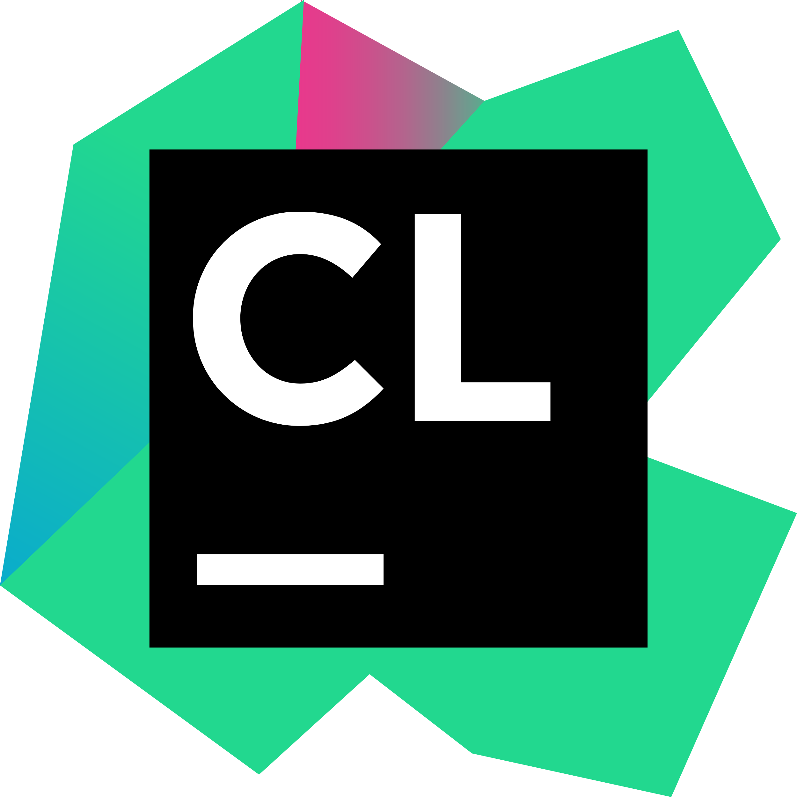
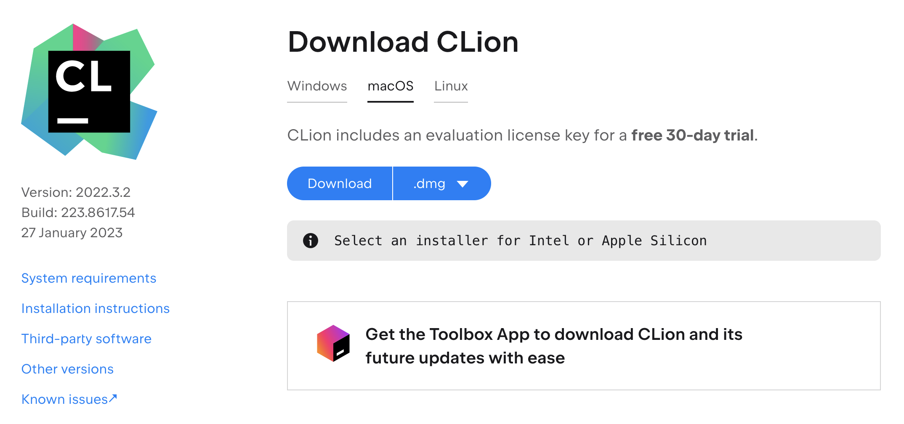
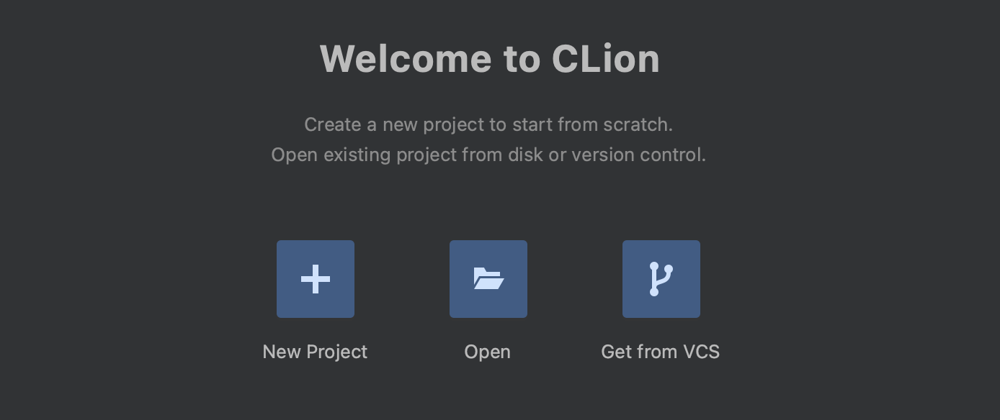
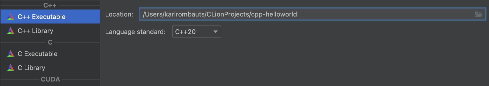
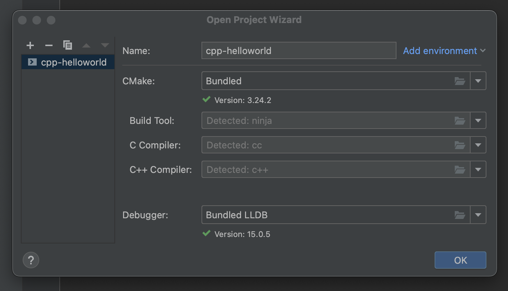
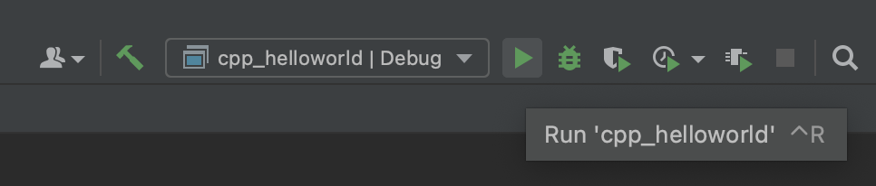

#   Getting Started with CLion

CLion is an Integrated Development Environment (IDE) for C++ development. It is developed by JetBrains and provides a powerful set of features for C++ development, such as syntax highlighting, code refactoring, code completion, version control, debugging, and more. CLion is designed to help developers quickly and efficiently develop their C++ projects, and provides a modern, well-rounded development environment. It is also compatible with a wide range of C++ compilers, including GCC and Clang.

Jetbrains software is normally not free to use, but they do provide a free licence to all their IDEs for students, teachers, open-source contributors, and non-commercial contributors. This licence allows you to use JetBrains software for educational, open-source and non-commercial purposes. The licence is valid for one year, after which you can renew the licence if they are still eligible.

### Step 1: Install CLion

Download and install CLion from https://www.jetbrains.com/clion/download.

  

You can also download the Toolbox App [here](https://www.jetbrains.com/toolbox-app/), which allows you to easily download and update JetBrains products.

### Step 2: Create a new project

1. Launch CLion and select "New Project" from the Welcome screen.

      

2. Select C++ Executable from the list of project templates.

      

3. Choose a location and name the project "cpp-helloworld"
   
4. Set the language standard to C++20

5. Click on **Create**

6. Set the project name to "cpp-helloworld" and accepts the default settings in the Project Wizard

      

    You should now be greated with a main.cpp file that contains
    ```cpp
    #include <iostream>

    int main() {
        std::cout << "Hello, World!" << std::endl;
        return 0;
    }
    ```
### Step 3: Building Project

To compile and run your program, click the ▶️ button in the toolbar (`Ctrl + R`).

  
