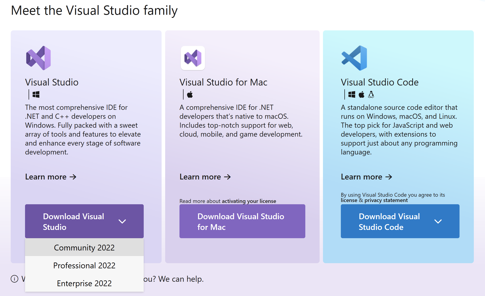
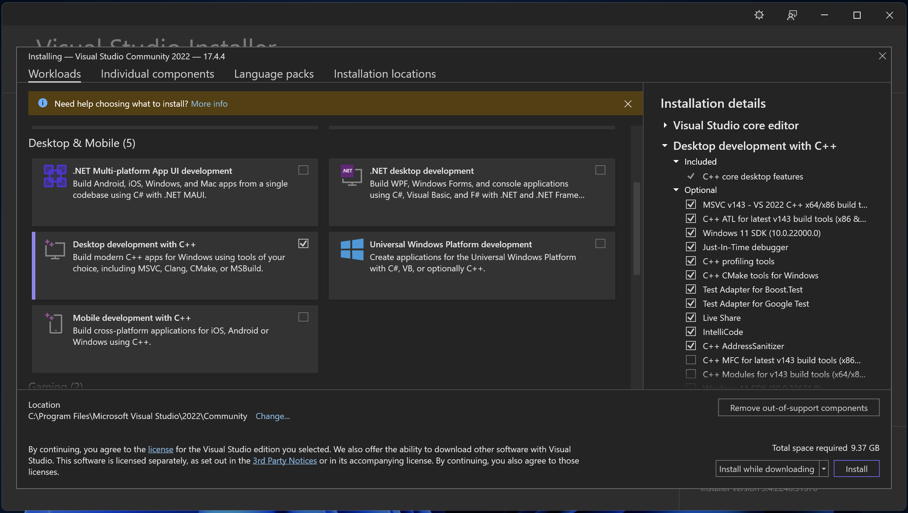
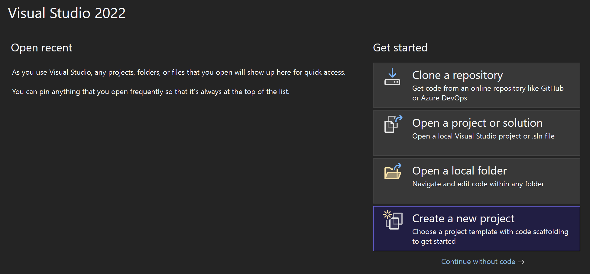
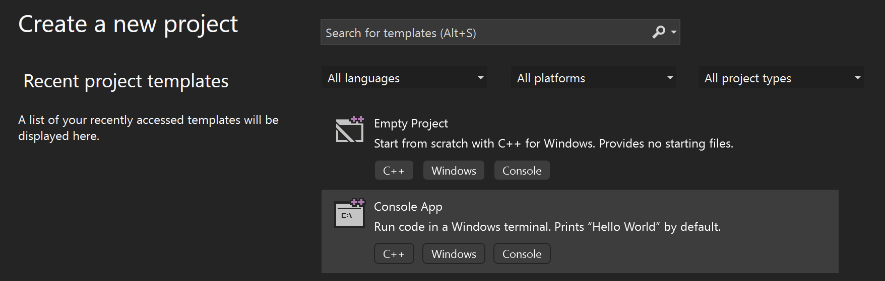
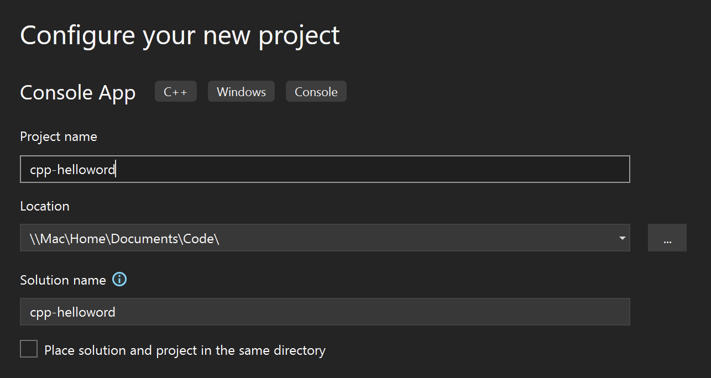
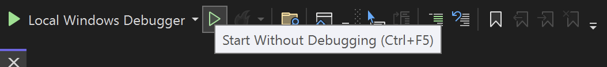

#   Getting Started with Visual Studio (Windows Only)


Visual Studio is a Windows-only development environment from Microsoft. It is designed specifically for the development of C++ applications and programs. Visual Studio provides a comprehensive set of tools for creating, debugging, and optimizing C++ applications. It also includes a wide range of debugging tools and a powerful editing environment. Visual Studio is the industry standard for Windows-based development of C++ applications and is used by many professional developers.


Microsoft does offer a version of Visual Studio for MacOS. However, this version does not support the development of C++ applications. It is primarily designed to develop .NET applications and does not support C++.

### Step 1: Install Visual Studio

1. Download Visual Studio (Community Edition) from: https://visualstudio.microsoft.com/
 
      

2. In the installer wizard, select **Desktop development with C++**. Feel free to choose any others that also interest you.
   
     

### Step 2: Create a project

1. Once Visual Studio is installed, launch the program.

2. On the main screen, select “Create a new project”.

      


3. On the next screen, select **Console App (C++)**.

      

4. Next, specify a location to save your project and name it **cpp-helloworld**.

      

5. Once the project is created, you should see a new fill called `cpp-helloworld.cpp`.

    ```cpp
    // cpp-helloword.cpp : This file contains the 'main' function. Program execution begins and ends there.
    //

    #include <iostream>

    int main()
    {
        std::cout << "Hello World!\n";
    }

    // Run program: Ctrl + F5 or Debug > Start Without Debugging menu
    // Debug program: F5 or Debug > Start Debugging menu

    // Tips for Getting Started: 
    //   1. Use the Solution Explorer window to add/manage files
    //   2. Use the Team Explorer window to connect to source control
    //   3. Use the Output window to see build output and other messages
    //   4. Use the Error List window to view errors
    //   5. Go to Project > Add New Item to create new code files, or Project > Add Existing Item to add existing code files to the project
    //   6. In the future, to open this project again, go to File > Open > Project and select the .sln file
    ```
6. To compile and run your program, click the ▶️ button in the toolbar (`Ctrl + F5`).

      
