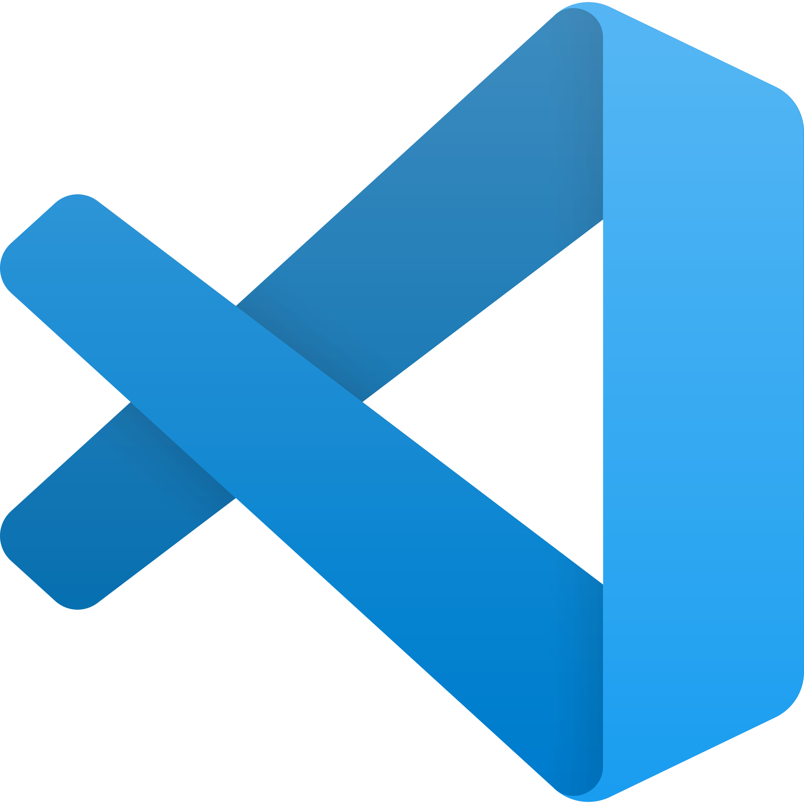
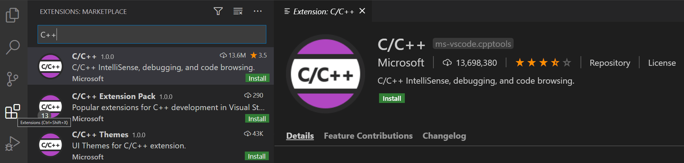
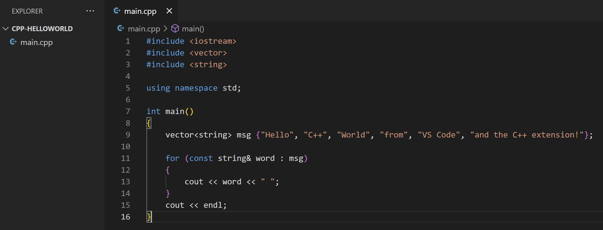
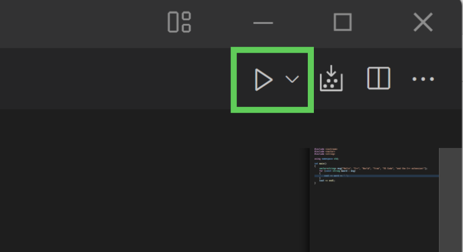
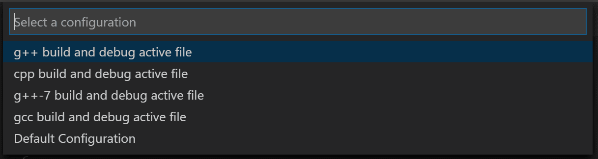
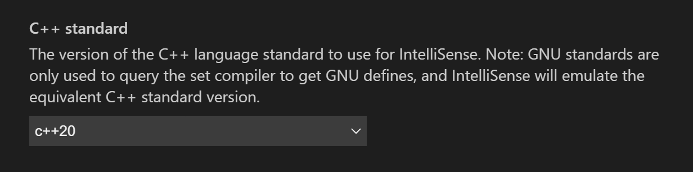

#  Getting Started with VS Code

 
Visual Studio Code (VS Code) is a code editor developed by Microsoft for Windows, Linux, and macOS. It is an open-source and free-to-use editor that supports a wide range of programming languages and platforms, including C++. VS Code is a popular choice for C++ development due to its lightweight, fast, and intuitive user interface, as well as its comprehensive set of features designed to make coding easier and faster. 

## Step 1: Install Visual Studio Code
1. Download Visual Studio Code from here: https://code.visualstudio.com/ 
2. Follow the installation instructions

## Step 2: Install the C/C++ extension
1. Once Visual Studio Code is installed, open it 
2. go to the Extensions marketplace (`Ctrl + Shift + X`). 
3. Search for "C++" in the search bar and install the Microsoft C/C++ extension.

  

## Step 3: Create C++ Project

1. In a terminal, run the following commands
    ```sh
    mkdir cpp-helloworld
    cd cpp-helloworld
    code .
    ```

2. Create a new C++ file called main.cpp and paste in the following code:

    ```cpp
    #include <iostream>
    #include <vector>
    #include <string>

    using namespace std;

    int main()
    {
        vector<string> msg {"Hello", "C++", "World", "from", "VS Code", "and the C++ extension!"};

        for (const string& word : msg)
        {
            cout << word << " ";
        }
        cout << endl;
    }
    ```

    Your editor should look like this:

      

## Step 4: Compile and run your program

#### Compiling using "Build and Run"
The easiest way to compile and run your program is by clicking the ▶️ button at the top right corner.

 

Then choose **g++ build and debug active file**

  

You should get the following output in the terminal if everything is set up correctly.

```
Hello C++ World from VS Code and the C++ extension! 
```

#### (Optional) Compiling from the terminal

You can also compile files manually from the terminal by running the following command:

```
g++ main.cpp -o main -std=c++20
```

To understand this command, let's break it down
- `g++` is the compiler
- `main.cpp` is the source code we want to compile
- `-o main` is the name of the output file 
- `-std=c++20` sets the c++ language version to c++20

And then, to run the program from the command line, run the following command:
```
./main
```

You should get the following output in the terminal if everything is set up correctly.

```
Hello C++ World from VS Code and the C++ extension! 
```

## Step 5: Configure IntelliSense for C++20:

To be able to use some newer features of C++ released in language version C++20, we need to change the C++ configuration. 

1. Open the Command Palette (`Ctrl + Shift + P`)
2. Search for "C/C++: Edit Configurations (UI)"
3. Change the option that says **C++ standard** to **C++20**

  
