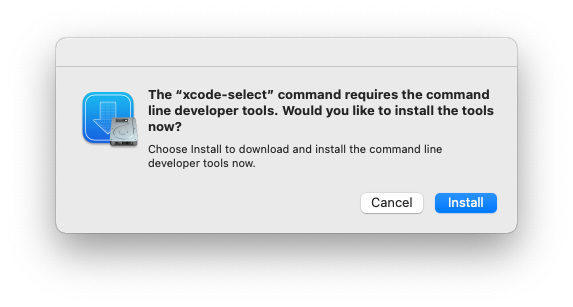
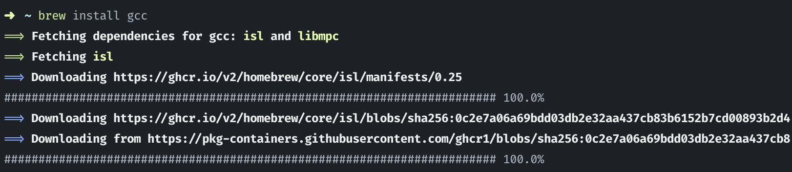

# Installing a C++ Compiler (MacOS)

To get started with C++ on MacOS, we need to first install a compiler to turn our source code into an executable.

## Method 1: Xcode Command Line Tools

Xcode Command Line Tools are a collection of command-line tools for developing software on Mac OS X. They are necessary for C++ development because they provide the compilers and other tools needed to build and run C++ programs on the Mac. 
  
1. Open the Terminal application

2. Type the following command: 
   ```
   xcode-select --install
   ```

3. Click the "Install" button when prompted to confirm the installation.

  

4. Agree to the license agreement

5. Wait for the installation to finish

6. You can verify the installation by typing the following command: 
   ```
   xcode-select --version
   ```
   This should return the version of Xcode Command Line Tools installed on your Mac

**DISCLAIMER:** The only downside to using Xcode Command Line Tools is that it does not actaully install **g++**, which is the compiler that we will be using to grade your assignments. MacOS sneakily just creates a an alias for g++, which actually runs clang (another C++ compiler). To install g++ please follow the method using Homebrew

You can check this yourself by running `g++ --version` in the terminal.

```
$ g++ --version

Apple clang version 14.0.0 (clang-1400.0.29.202)
Target: x86_64-apple-darwin22.2.0
Thread model: posix
InstalledDir: /Library/Developer/CommandLineTools/usr/bin
```

Sneaky Apple... 👀 

## Method 2: Using Homebrew 🍻

Homebrew is a package manager for macOS that makes it easy to install and manage open-source software. It allows you to install thousands of packages, such as command-line tools, applications, libraries, and developer tools, directly from the command line. Homebrew also makes it easy to keep these packages updated and ensures that you always have the latest versions.

#### Step 1: Install Homebrew (Skip if already installed)
1. Install Homebrew by entering the following command into the terminal (or follow the instructions [here](https://brew.sh/))

   ```sh
   /bin/bash -c "$(curl -fsSL https://raw.githubusercontent.com/Homebrew/install/HEAD/install.sh)"
   ```

2. Follow the instructions and then restart the terminal

#### Step 2: Install g++ using Homebrew

1. To install gcc and g++ run the following command in the terminal

   ```
   brew install gcc
   ```

   This will start installing a bunch of dependencies and then will finally install g++.

     

2. Restart the terminal
   
3. Check that g++ is installed by running `g++-12 --version` in the terminal, which should output

   ```
   g++-12 (Homebrew GCC 12.2.0) 12.2.0
   Copyright (C) 2022 Free Software Foundation, Inc.
   This is free software; see the source for copying conditions. There is NO warranty; 
   not even for MERCHANTABILITY or FITNESS FOR A PARTICULAR PURPOSE.
   ```

   **NOTE:** The Homebrew install of g++ adds the suffix "-12" to the executable name to avoid clashing with the "fake" g++ that Apple installs.

#### Step 3: Install make using Homebrew (Optional)

You might also want to install make, which is a powerful build tool to automate compiling files. To install it, run the following command from the terminal.

```
brew install make
```

