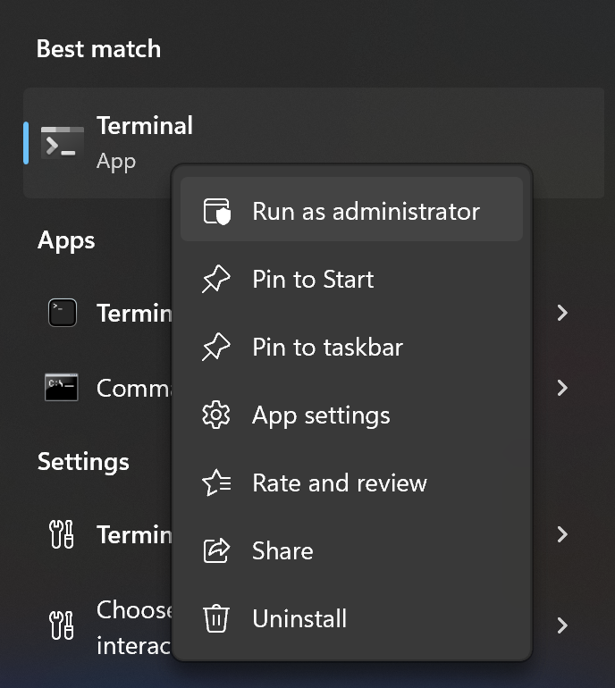

# Installing a C++ Compiler (Windows)

Windows does not come with a C++ compiler preinstalled, so we need to install MinGW in order to compile and run C++ programs. MinGW (Minimalist GNU for Windows) is a port of the GNU Compiler Collection (GCC) and GNU Binutils for use in the development of native Microsoft Windows applications. It allows us to compile and run C++ programs on Windows machines.

Amongst other things, MinGW will install
- g++ (compiler for C/C++ files)
- gcc (compiler for C files)
- clang (compiler for C/C++ files)
- make (build tool)

The easiest way to install MinGW is by using Chocolatey. Chocolatey is a package manager for Windows that gives you an easy way to install and update software packages. It helps you keep track of installed packages and quickly install updates or roll back to previous versions. 

You can find out more here: https://chocolatey.org. And here is the official installation guide: https://chocolatey.org/install, which is summarised bellow.

## Step 1: Install Chocolatey (Skip if already installed)

1. Open either Windows PowerShell or Terminal as an administrator. Search for either program and then right-click and select "Run as administrator" 
   
   

2. Run the following command in PowerShell to install Chocolatey: 
    ```ps
    Set-ExecutionPolicy Bypass -Scope Process -Force; [System.Net.ServicePointManager]::SecurityProtocol = [System.Net.ServicePointManager]::SecurityProtocol -bor 3072; iex ((New-Object System.Net.WebClient).DownloadString('https://community.chocolatey.org/install.ps1'))
    ```

3. Once the installation is complete, you will need to close and reopen PowerShell or Terminal as an administrator. 

4. You can then test your installation by running the following command: `choco --version`
   
   You should see the following output (the version number might be different):

    ```ps
    PS C:\Users\karlrombauts> choco --version
    1.2.1
    ```

## Step 2: Install MinGW using Chocolatey

1. Open either Windows PowerShell or Terminal as an administrator.

2. Run the following command: 
   
    ```ps
    choco install mingw
    ```
3. When it prompts 
   ```
   Do you want to run the script?([Y]es/[A]ll - yes to all/[N]o/[P]rint):
   ```
   Enter type `Y` and hit enter

4. you will need to close and reopen PowerShell or Terminal. 

5. You can then test your installation by running the following command: `g++ --version`

    You should see the following output (the version number might be different):

    ```
    PS C:\Users\karlrombauts> g++ --version
    g++.exe (MinGW-W64 x86_64-ucrt-posix-seh, built by Brecht Sanders) 12.2.0
    Copyright (C) 2022 Free Software Foundation, Inc.
    This is free software; see the source for copying conditions. There is NO
    warranty; not even for MERCHANTABILITY or FITNESS FOR A PARTICULAR PURPOSE.
    ```

Congratulations, you now have both Chocolatey and MinGW installed! 

P.S. You can use choco to install lots of other dev tools. Some examples are:

- `choco install git.install`
- `choco install firefox`
- `choco install python`
- `choco install make`

